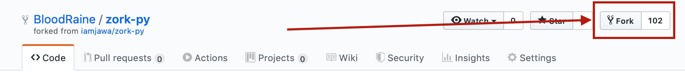

# Large File Systems (LFS)

This is it, our final lab.
(for extra Credit)
Congratz! You've made it!

Lets put all of that newfound knowledge to good use in a way that you would 
realistically see in your career. For this final culmination of our efforts this
semester we will be working with a large file system created by someone else and 
you are tasked to modify it.

If you do not have an account on Github.com, make one now. you will need it for this assignemnt. 
If you need help learning and setting up github, you can find a short workshop on it here: https://github.com/rileymiller/csci102-git-demo
or in the video here: https://www.youtube.com/watch?v=0fKg7e37bQE
If you are working on a windows machine, we reccomend installing gitBash (https://gitforwindows.org) to work with git repositories.
Most Apple computer's compe pre-installed with git. If you run into issues setting up git, 
a quick google search will usually set you strait.

Once you are familiar with git

Go to this github link (https://github.com/BloodRaine/zork-py) and fork the repository
by clicking the fork button on the top right. This will create a copy of this repo 
on your account.


Once you have the repository forked, it should show up on the list of repositories on your account.
Clone the repository onto your computer.

Go ahead and run it by navigating into the src directory and running python3 main.py or 
opening the file in idle and clicking the run button. 
See what it does!?

# Zork
If you unfamiliar, ZORK is a text based adventure game that was developed in ancient times 
(relatively). The goal is not so obvious, but simple. Find the treasure and dont get eaten by a monstorous grue.
There are various "rooms" all with interactable objects and connected passages between them. Lots of secret puzzles
and fun areas to explore, all while trying your best to avoid typing "kick the bucket" to quickly exit the game.

We've provided you with the code to run the game of Zork, however, the code is poorly structured and the game is missing some functionality.
First off, there's no grue! Well thats no fun how are we supposed to get eaten in the dark? Also, I dont know if you noticed,
but we can read the leaflet before even opening the mailbox that it's in and picking it up! This is all kinds of wrong.
Additionally, the overarching structure could use some serious reworking, or refactoring, as we call it.

Lets fix this up.

# Final Lab

This lab is worth 14 points should you complete the whole thing, in CSCI102, that is worth 7% of your final grade!

For this final lab, we will be re-organizing existing code and adding additional functionality to it.
The existing code all exists in several files that each have their own purpose and functionality.
This process is extremely commin in the workplace as you will rarely start something from 
scratch. You'll most commonly be tasked to refactor or add additional functions to an existing
code base, often times several tens of thousands of lines of code long. Don't worry, we aren't going that extreme.

If at any point you have questions on what a part should be doing, please email Robbie at rdmerillat@alumni.mines.edu
or post on piazza.

# Submission
This lab has several functions, and will take quite some time to complete all sections. As this is for extra credit, you 
will recieve credit/partial credit for anything you do manage to complete and you can try to tackle any part in particular
(You dont have to do part B to do part C). 

In your README.md be sure to have:
- Name
- Date
- Course Section
- What parts of the extra credit you attempted and whether or not you successfully completed them
- Description of the project
- Challenges you faced and how you overcame them

When you have completed all you would like to, submit a URL to your github repo containing all updated code and documentation
into the comment box of your submission for EITHER CSCI101 or CSCI102. You may recieve the extra credit points in one of the 
courses, your choice, but not both.

NOTE: As we are looking through each of these submissions individually, 
there is no need for the "OUTPUT " before all of the print statements. Whew
glad we dont have to do that anymore.

# Part A - Functionalize - 5 PTS

Looking at the zork.py file, we can see that the Play_Zork function is doing most of the work, 
and its in a bunch of nested for loops. This is generally speaking poor practice to structure code
this kind of code in this way.

The goal for starters is strait-forward, functionalize this mess. Each "room" is 
currently contained within an internal while loop structure. Alternatively we could
add clarity and abtraction by changing the way this is structured. If we keep track of whether the player is alive,
and what room they are currently in, we can send the program into a different function 
for each room. Some of this we will want to do in the main.py file and some within the zork.py file.

The main.py should contain the overarching logic to control the game. That is:
1. The current status (alive or dead) if dead exit the game
2. The user input (ask the user what they would like to do)
3. Room number logic (depending on different room numbers, call zork.function_name_of_room_number)
4. A List of the currently held items. Those things can be handy. (You start out with none) 
(this is for extra credit in Part C and isn't necessary if you dont do the extra credit)

The zork.py file should only contain functions, one for each room to be exact. 

Each should be structured to where if we were to just load in the zork.py file, 
we could call Room0(user_input_string, itemList) and get an expected output based upon the 
string that went in. Each of these functions should be updated to return a truth value 
(indicating if the user is living or dead) and the roomNumber (to update your room 
and should the user choose to move around).

As this is an extra credit assignment, we won't be telling you exactly how many functions you will need, however,
be sure to name them something meaningful such as FrontOfHouse(), FrontOfHouseRoom(), ForestRoom(), etc.
This lab will not be run against 

For example:
```
def room4(inString): # This is the funcition for the starting room

def room#(input_string_from_user):
    ...
    return [roomNum, livingStatus] # either the same room num or different if moved
```

NOTE: In order to return multiple values from a function you must return them as a list, tuple, object, or dictionary.

What should we do with the room descriptions so they dont print out every time we call the function for a room you may ask?
You cn create a roomDescription function that gets called when you move into a new room that takes in the room number
and prints out the description based on which room you moved into.

# Part B - New Rooms - 4 PTS
For this Section of the lab, we will introduce additional rooms to the game to expand the world.
The rooms that will need to be added are as follows (0.5 PTS each)
- Back of the house
    - Description: You add this
    - Going East from the starting area will take you here instead of the message about the boarded up door
    - Going South from here will take you back to the front of the house
    - Goind West from here will take you into the house through the window with the following being printed "OUTPUT Opening a rickety window you climb into the house."
- Kitchen
    - Description: You find yourself in a dimly lit kitchen with dust covering the floor. (newline) A lantern rests on the kitchen island. (newline) A set of stairs lead up to another room.
    - Going up from here will take you to the Attic
    - Going east of here will take you back to the Back of the house
    - A Lantern can be found here (for part C)
- Attic
    - Description: 
    - Going down will lead back to the kitchen
- Maze Entrance
    - Description: You add this
    - Going North will lead you back to the cave
    - Going south from here will go deeper into the maze
    Note: Be sure to add this option to the cave function
- Maze Interior
    - Description: You add this
    - (Part C) If the player has the lantern, the grue is visible, inform the player that 
    - Going north will lead back to the entrance
    - Doing anything else will cause you to be eaten by the grue and the game will end
- Custom Room 1
- Custom Room 2
- Custom Room 3
    - Add a section to your README describing your rooms and what you can do in them

# Part C - Inventory Managment - 5 pts
You'll notice there was also an items.py file. This file contains some code to hold all the known items in the game and
three functions, one to pick up an item, one to put an item down, and a function to use an item. Or at least it should.
it doesnt contain everything as we were in the middle of writing it when we realized that the rest of the code needed some serious help.
Thats ok, you can help out here too. After re-writing the code during part A, you probably know all of the items in the game.

1. Fill in the lists so that each room list contains the items within that particular room (change the names to match which room is which better and add additional ones or take some away if you should need)
2. Change the print statements to contain the keyword
3. Finish writing the put down function and add the necessary code in zork.py to update the user's inventory
4. Define the useItem function which takes in an itemName and itemList. If the item exists within the list, print the folowing and return True